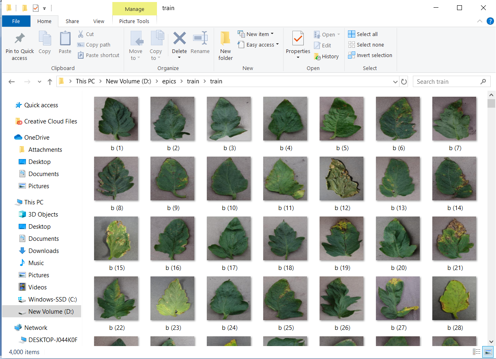

# Tomato-plant-Dataset

<h4><b> Bacterial_spot, Early_blight, Late_blight, Septoria_leaf_spot </b></h4>

<b><h2> Requirements: </h2></b>
1. Download the repository by clicking on the download button or type the following command in CMD to clone the repository:

       git clone https://github.com/AkhilaMadduri/Tomato-plant-Dataset.git

2. Download model from the following link and paste it in the `\dataset` folder:

       https://drive.google.com/file/d/1lw5J29JfjF54CIPm6b3qV_c23dEVBbQf/view?usp=sharing
       
3. Train data
             
       train_data.py - to generate train images and train labels
       
<b><h2> Screenshots: </h2></b>

<b><h3> Train dataset: </h3></b>

<b><h3> Test dataset: </h3></b>

